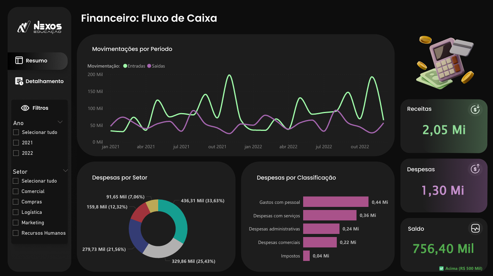
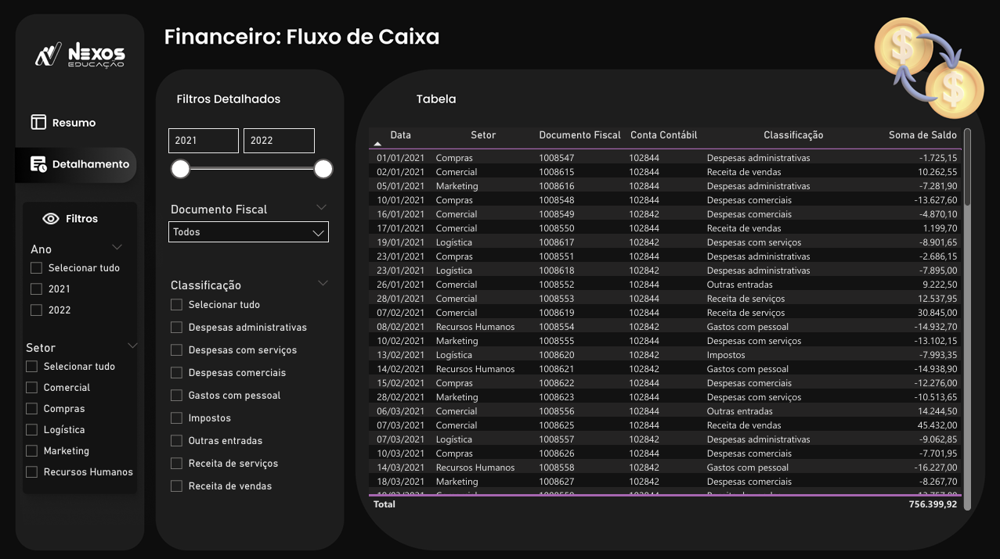

# 💰 Dashboard — Financeiro: Fluxo de Caixa

Visualização estratégica de indicadores financeiros e fluxo de caixa
para suporte à tomada de decisão.

 

---

## 🎯 Objetivo

Centralizar o monitoramento de entradas, saídas e saldo do fluxo de caixa,
permitindo análise detalhada de despesas por setor e classificação contábil
para apoiar decisões financeiras estratégicas.

---

## 📊 KPIs Monitorados

| Indicador | Valor |
|---|---|
| **Receitas** | R$ 2,05 Mi |
| **Despesas** | R$ 1,30 Mi |
| **Saldo** | R$ 756,40 Mil (acima de R$ 500 Mil) |

---

## 🔍 Análises Disponíveis

**Página 1 — Resumo**
- **Movimentações por Período** — comparativo de Entradas vs. Saídas de
jan/2021 a dez/2022
- **Despesas por Setor** — distribuição percentual por centro de custo:
Compras (33,63%), RH (25,43%), Logística (21,56%), Marketing (12,32%),
Comercial (7,06%)
- **Despesas por Classificação** — Gastos com pessoal (0,44 Mi), Despesas
com serviços (0,36 Mi), Despesas administrativas (0,24 Mi), Despesas
comerciais (0,22 Mi), Impostos (0,04 Mi)
- **Cards de Receitas, Despesas e Saldo** — com indicador de meta
- **Filtros** — por Ano (2021/2022) e Setor

**Página 2 — Detalhamento**
- **Tabela transacional completa** — Data, Setor, Documento Fiscal,
Conta Contábil, Classificação e Soma de Saldo por lançamento
- **Filtros detalhados** — por período (slider), Documento Fiscal e
Classificação (Despesas administrativas, Despesas com serviços, Despesas
comerciais, Gastos com pessoal, Impostos, Outras entradas, Receita de
serviços, Receita de vendas)
- **Total geral** — R$ 756.399,92

---

## 🗂️ Modelagem de Dados

Modelo com 2 tabelas:

| Tabela | Tipo | Campos principais |
|---|---|---|
| **Movimentações** | Fato | Centro de Custo, Classificação, Conta Contábil, Data, Documento Fiscal, Saldo, Status, Tipo Movimentação, Valor |
| **Setores** | Dimensão | Centro de Custo, Setor |

---

## 📐 Medidas DAX

| Medida | Descrição |
|---|---|
| `Saldo` | Saldo total do período (Receitas - Despesas) |
| `Valor` | Valor total das movimentações |
| `Meta` | Meta de saldo definida para o período |
| `Conta Contábil` | Referência contábil de cada lançamento |

---

## 🛠️ Tecnologias

